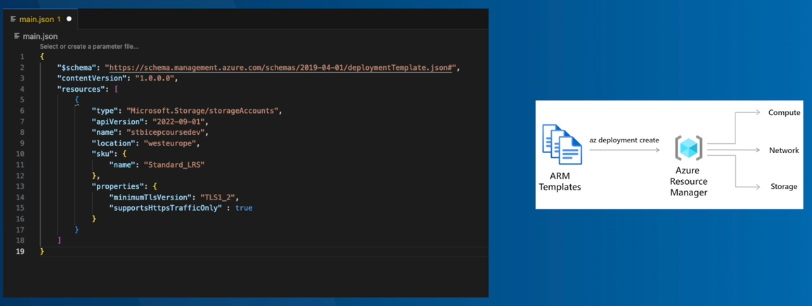
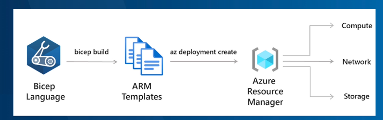
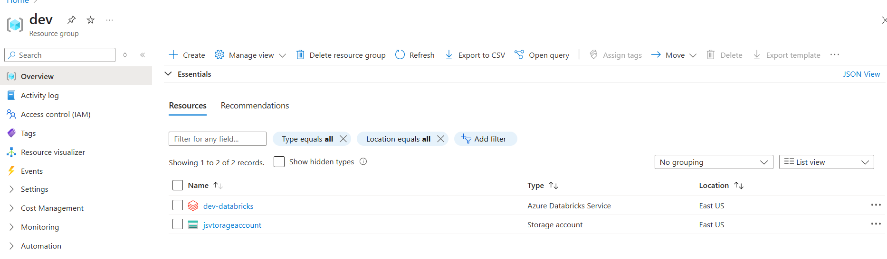
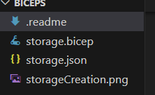
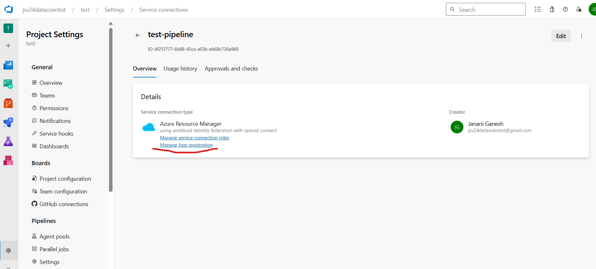
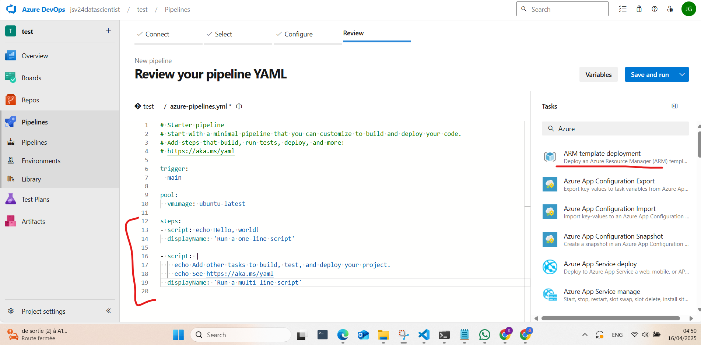
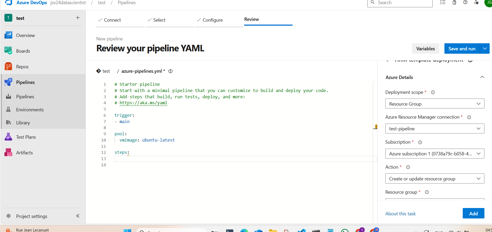
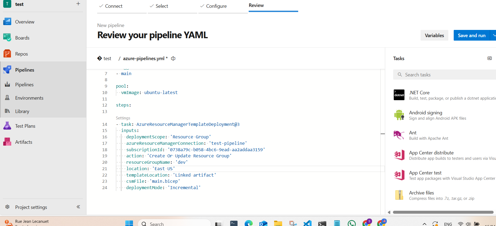
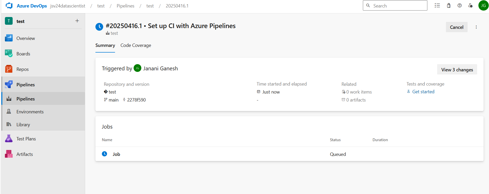
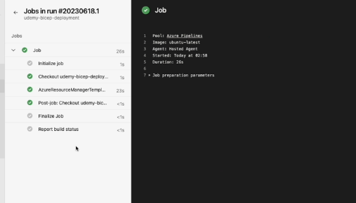

# Infrastructure as Code (IaC) using Bicep and Azure DevOps
 
 This Bicep module defines and deploys Azure resources.
 
 Parameters:
 - [List all parameters here with their descriptions, e.g.,]
   - `paramName`: Description of the parameter.
 
 Outputs:
 - [List all outputs here with their descriptions, e.g.,]
   - `outputName`: Description of the output.





 Usage:
 - Use the following commands to create a subscription and resource group before deploying the storage module:

   ```bash
   # Log in to Azure
   az login
   
   # Set the subscription (replace <subscription-id> with your subscription ID)
   az account set --subscription <subscription-id>
   
   # Create a resource group (replace <resource-group-name> and <location> with your values)
       az group create --name <resource-group-name> --location <location>
     az group create --name dev --location eastus
   ```

 # create the storage
 ```bash
 #create the storage
 az deployment group create --resource-group dev --template-file ./storage.bicep
 ```
 

 Bicep is working with the Azure Resouce Manager(ARM) but not replacing it.
 We can create the json file from the bicep file.

 ```bash
 #create the json file from bicep file
 az bicep build --file ./storage.bicep
```
 The above command will create the storage.json

 


# Deploy using the Azure Devops 
Project Setting -> Service Connections -> New 


So now we can create the pipeline in the azure devops




Using the assistance we have added the script



Click on the job and vaidate the service connection




# Steps to create the pipeline in Azure DevOps
1. Create a new pipeline in Azure DevOps.
2. Select the repository where your code is stored.
3. Choose the pipeline type as "Azure Resource Manager template deployment".
4. In the "Azure subscription" dropdown, select the subscription where you want to deploy the resources.
5. In the "Azure resource group" dropdown, select the resource group where you want to deploy the resources.
6. In the "Template file" field, select the "storage.json" file that you created earlier.
7. In the "Parameters" field, add the parameters that you want to pass to the template.
8. Save and